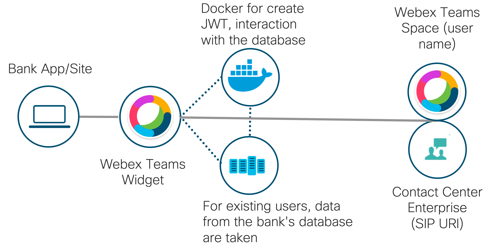
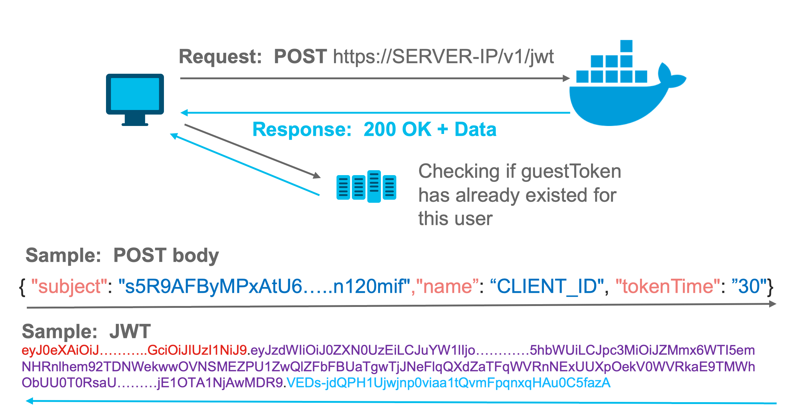

# Webex widget: simple demo

This repo is simple demo of Webex widget, include:
 
- [x] vue UI part where users can type in personal data to create conversation or make a call
- [x] Dockerize server app that give you J(SON) W(eb) T(oken)
- [x] in this repo, you can find split microservices, with which you can interact using REST API
 

For which purpose you can use it:
- for banks, supports
- e-commerce
- public sector


### Business challenge
- Make a solution for banks that helps banks to collaborate and verify customers 
- Integration calls from banks app/site with Contact Center Enterprise
- Many bank branches have moved to remote work. (So the work and verification of clients moved to online)


### Requirements
- [Python](https://www.python.org/downloads/)
- [Docker](https://www.docker.com/get-started)
- [Node](https://nodejs.org/en/download/)

### Clone and open project

```
git clone https://github.com/oborys/simple_demo_webex_widget.git
cd simple_demo_webex_widget
```
Open files `server/webex_cred` and paste your variable 

```
docker-compose up
```

Solution scheme


**Paste it into the file `views.py` variable `bearer`**

In this repo, you can find useful Dockerize solution with which you can interact using REST API 


> If you run the app at 15:14 bot report will be sent at 20:14

**Other Useful links**

- [How To Build and Deploy a Flask Application Using Docker on Ubuntu 18.04](https://www.digitalocean.com/community/tutorials/how-to-build-and-deploy-a-flask-application-using-docker-on-ubuntu-18-04)
