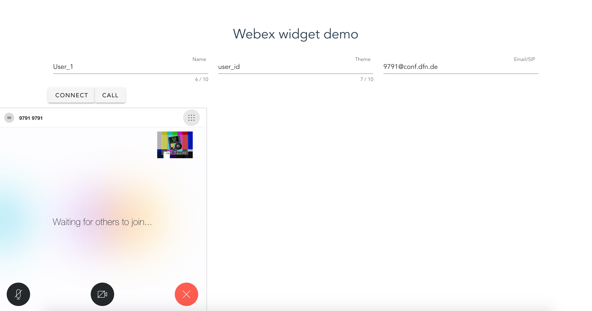

# Webex widget: simple demo

This repo is a simple demo of Webex widget, include:
 
- [x] vue UI part where users can type in personal data to create conversation or make a call
- [x] Dockerize server app that gives you J(SON) W(eb) T(oken)
- [x] in this repo, you can find split microservices, with which you can interact using REST API
 

For which purpose you can use it:
- for banks, supports
- e-commerce
- public sector


### Business challenge
- Make a solution for banks that helps banks to collaborate and verify customers 
- Integration calls from banks app/site with Contact Center Enterprise
- Many bank branches have moved to remote work. (So the work and verification of clients moved to online)


### Requirements
- [Python](https://www.python.org/downloads/)
- [Docker](https://www.docker.com/get-started)
- [Node](https://nodejs.org/en/download/)

### Clone and open project

```
git clone https://github.com/oborys/simple_demo_webex_widget.git
cd simple_demo_webex_widget
```

Create Webex Guest Issuer [https://developer.webex.com/my-apps/new](https://developer.webex.com/my-apps/new)

Open files `server/webex_cred` and paste your variable `Guest Issuer ID` as `WEBEX_TEAMS_ISSUER_ID` and `Shared Secret` as `WEBEX_TEAMS_ISSUER_SECRET`

```
docker-compose up
```

Ensure the app is running in the browser
[http://localhost:80](http://localhost:80) 

Bring down the containers:

```
docker-compose stop
```

## Solution scheme


In this repo, you can find useful Dockerize solution with which you can interact using REST API 


After enter all data and push **Call** button, call will enable


#### Online demo
- [https://webex-widget.herokuapp.com/](https://webex-widget.herokuapp.com/)

**Other Useful links**

- [https://developer.webex.com/docs/guest-issuer](https://developer.webex.com/docs/guest-issuer)
